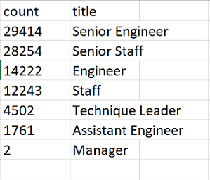

# Pewlett-Hackard-Analysis
##Overview of the Analysis##

Pewlett Hackard is a maturing company with thousands of employees. PH is looking to the future in two ways: 1) Offer retirement packages for those who meet certain criteria, and 2) The number of persons reiring in the upcoming years will potentially create thousands of open positions and PH desires to be prepared for the potential impact of the retirements. Bobby, a PH employee in the HR department, is leading the preparation for the upcoming retirements by determining who will be retiring and how many positions will be vacated. The data Bobby has access to is contained mainly in six 'CSV' files because PH has used Excel and VBA to manage their data. At this time, PH has made the decision to use SQL to build a new employee database. I've been asked to apply my data modeling, engineering, and analysis skills to assist Bobby with the creation of a new employee database using SQL.    

Results of the Analysis

The analysis of the PH data revealed several interesting trends. I will provide four major points for consideration.  

1.) The majority of possible retirements is found in Senior Engineers(29,414) and Senior Staff(28,254). The data reveals tenure has played a large role in populating the majority of Senior level positions. "How many Senior Engineers and Senior Staff are working at PH currently?"

     
     

2.)

3.)

4.)

Summary 

I will provide a high-level responses to the following questions and include then provide two additional queries or tables that may provide more insight into the upcoming "silver tsunami."
1.) How many roles will need to be filled as the "silver tsunami" begins to make an impact?

2.) Are there enough qualified, retirement-ready employees in the departments to mentor the next generation of Pewlett Hackard employees?

Deliverable 3 Requirements
Structure, Organization, and Formatting (6 points)
The written analysis has the following structure, organization, and formatting:

There is a title, and there are multiple sections. (2 pt)
Each section has a heading and subheading. (2 pt)
Links to images are working and displayed correctly. (2 pt)
Analysis (14 points)
The written analysis has the following:

Overview of the analysis:

The purpose of the new analysis is well defined. (3 pt)
Results:

There is a bulleted list with four major points from the two analysis deliverables. (6 pt)
Summary:

The summary addresses the two questions and contains two additional queries or tables that may provide more insight. (5 pt)
