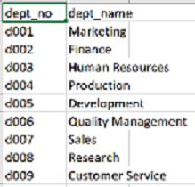

# Pewlett-Hackard-Analysis
##Overview of the Analysis##

Pewlett Hackard is a maturing company employing hunderds of thousands of employees. PH is looking to the future in two ways: 1) Offer retirement packages for those who meet certain criteria, and 2) Determinig the number of persons retiring in the upcoming years who may potentially create thousands of open positions. PH desires to be prepared for the potential impact of the retirements. Bobby, a PH employee in the HR department, is leading by determining who will be retiring and how many positions will be vacated. The data Bobby has access to is contained mainly in six 'CSV' files because PH has used Excel and VBA to manage their data in the past. At this time, PH has made the decision to make a change and use the more efficient SQL to build a new employee database. I've been asked to apply my data modeling, engineering, and analysis skills to assist Bobby with the creation of a new employee database using SQL.    

Results of the Analysis

The analysis of the PH data revealed several interesting trends. I will provide four major points for consideration.  

1.) The majority of possible retirements is found in Senior Engineers(29,414) and Senior Staff(28,254)(fig. 1). The data reveals tenure has played a large role in populating the majority of Senior level positions. Securing a large number of the Senior level employees to serve as mentors over the next several years to 'raise up' the future leaders of the company will provide the necessary transition for PH's future. 

fig. 1                                             
                  

fig. 2
          

fig. 3
    

     
     

2.) There is going to be a .............. or PH may need to streamline their departments until appropriate hires are made to fill the critical needs.

3.) The number of managers leading the nine departments who are leigible for retirement is low (2)(fig. 1). This data suggests the persons who are responsible for departmental leadership may remain consistent, unless managers are promoted to senior leadership positions. Otherwise, if managers are viewed as primary candidates for senior positions, there will need to be emphasis placed on preparing for an equally significanrt shift in mid-level leadership at PH. 

4.) 

Summary 

I will provide a high-level responses to the following questions and provide two additional examples that may provide more insight into the upcoming "silver tsunami."
1.) How many roles will need to be filled as the "silver tsunami" begins to make an impact?
Looking at fig. 1 above, if all employees who are eligible retired, the segment represents 90,398 employees. The data reveals in fig.## that the total number of employees is 300,024 (Employees.csv). Thirty percent of PH's employees are eligible for retirement based on the specific criteria established.  

2.) Are there enough qualified, retirement-ready employees in the departments to mentor the next generation of Pewlett Hackard employees?
Staging the "silver tsunami" to sweep through the departments of PH over the next three to five years is a highly desireable model. The large number of Senior Engineers and Senior Staff will provide numerical potential for a successful shift in departmental leadership. A staged approach will give time for Senior Level employees to adequately pass along critical information and practices while encouraging new networks of relationships among those who are identified to serve as the next leaders. Investing in benchmarking hiring policies and procedures is highly recommended.   

Deliverable 3 Requirements
Structure, Organization, and Formatting (6 points)
The written analysis has the following structure, organization, and formatting:

There is a title, and there are multiple sections. (2 pt)
Each section has a heading and subheading. (2 pt)
Links to images are working and displayed correctly. (2 pt)
Analysis (14 points)
The written analysis has the following:

Overview of the analysis:

The purpose of the new analysis is well defined. (3 pt)
Results:

There is a bulleted list with four major points from the two analysis deliverables. (6 pt)
Summary:

The summary addresses the two questions and contains two additional queries or tables that may provide more insight. (5 pt)
